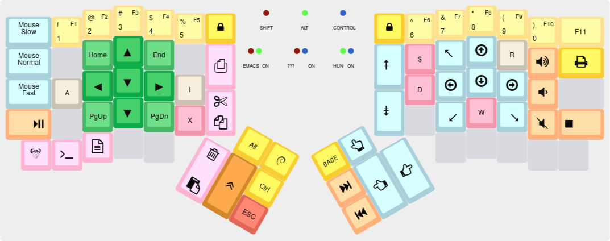

algernon's layout
=======================

This is an unconventional layout for the ErgoDox EZ, one that is still
evolving. For the reasons of my choices, the whys and whatnot, see my
[blog posts about my ErgoDox journey][blog-ergodox].

 [blog-ergodox]: https://asylum.madhouse-project.org/blog/tags/ergodox/

Here, I'll just present the layout itself, but for more information,
see the blog. Once the layout is stable, as in, has not changed
considerably for over a month, I'll sum it up here. Until then, it is
a huge burden to keep up in two places.

So, the layers!

## Base layer

[](http://www.keyboard-layout-editor.com/#/gists/28f7eb305fdbff943613e1dc7aa9e82b)


## Emacs layer

[](http://www.keyboard-layout-editor.com/#/gists/e4556d8dc59736c26d51a58cb4c4d2f0)

## Hungarian layer

[](http://www.keyboard-layout-editor.com/#/gists/b160f6ec90d58c127c114c89f66e9dc9)

# Building

To make my workflow easier, this layout is in its own repository. To build it,
you will need the [QMK][qmk] firmware checked out, and this repo either checked
out, or symlinked to `keyboard/ergodox_ez/algernon`. One way to achieve that is
this:

```
$ git clone https://github.com/jackhumbert/qmk_firmware.git
$ cd qmk_firmware/keyboard/ergodox_ez
$ git clone https://github.com/algernon/ergodox-layout.git keymaps/algernon
$ make KEYMAP=algernon
```
