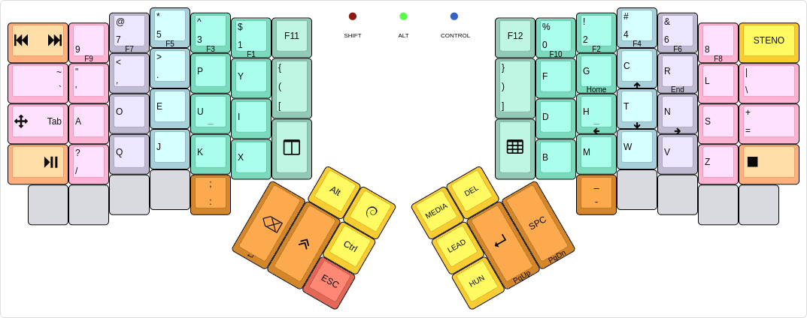
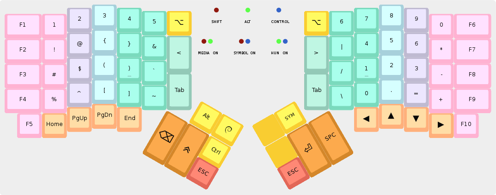
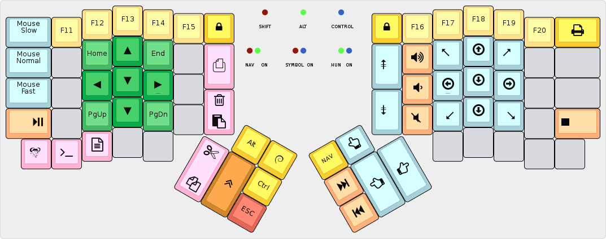
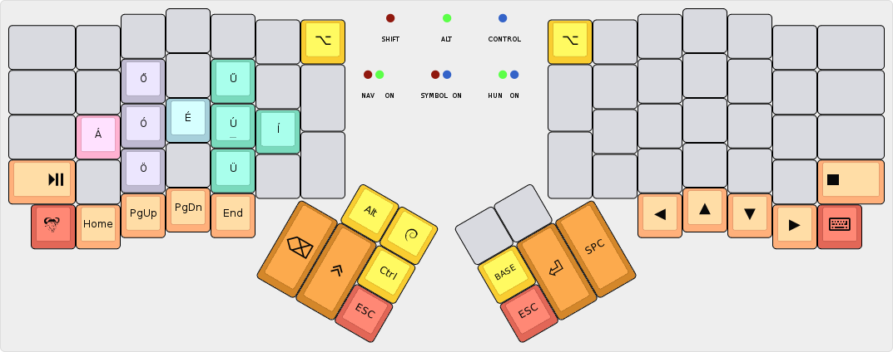

algernon's layout
=======================

This is an unconventional layout for the ErgoDox EZ: first of all, it is based
on the Dvorak layout, but moves a few keys elsewhere for an improved coding
experience. Second, there is no `DEL` key, nor a `Caps Lock`. Third, the
`SHIFT`, `Alt`, and `Control` keys are all sticky: when you press and release
them, they still register pressed, until you toggle them off.

But lets get on with the base layer, before I dive into a deeper explanation!

## Base layer

[](http://www.keyboard-layout-editor.com/#/gists/28f7eb305fdbff943613e1dc7aa9e82b)

As you can see, this appears to be a somewhat unremarkable Dvorak layout, with
some very minor changes:

* The `Backslash/Pipe` key moved a row up, because it is easier to reach it on
  the 4th row than on the 5th.
* Consequently `Minus/Underscore` key was moved to the left half.
* There are dedicated `bracket` and `parens` keys.

Apart from these changes, as far as the alphanumerics are considered, this is
just plain old Dvorak. The fun comes with the modifiers, and their behaviour!

Originally, I had the `Shift` keys at their more conventional position, on the
sides of the keyboard, where `Minus` and `Backslash` are right now. The `Alt`,
`Control`, `GUI`, and `Apps` keys were on the bottom row, and `ESC` up top. But
I press modifiers very often, so placing them on the bottom row was incredibly
inconvenient, and my fingers struggled reaching them, let alone holding them. On
the other hand, I use the navigational keys less often, and when I do, I will
likely stay in navigation mode for some time.

For these reasons, I rearranged the keys to their current position: modifiers,
layer switchers, `Backspace`, `Return`, `Space` and `ESC` are all on the thumb
cluster, because my strongest digit has no problem hitting them often. It is
easy to reach them, and them being toggles, I don't even have no hold them.

The navigation keys are somewhat experimental at the moment, I'm not entirely
happy with how they turned out. Yet, I am playing with the idea of learning to
switch to the media layer for navigational needs. We'll see how that works in
the next few weeks.

There are two more interesting keys: the red ones on the far sides. The left one
simply sends `M-m`, for the rare case when my Spacemacs is in `holy-mode`. The
right one is the Unicode compose key: it sends a sequence that tells my OS that
we are doing unicode composition.

As for the coloring of the keys: the guiding idea is that keys pressed by the
same finger have the same color. But that is just a guide, because the thumb
cluster has many colors, all pressed by the same digit. Functionality is the
other guide, for most special keys.

## Symbols layer

[](http://www.keyboard-layout-editor.com/#/gists/dad30ce9d478a336d3513b560b790930)

The symbol layer is a bit more conventional, and retains most of the special
keys in the same position as in the base layer. As an addition, function keys
appear on the sides, and the two other layer toggles turn into a `λ` and a
shruggie sequence, for various reasons.

The key colors were done the same way as in the base layer.

## Navigation layer

[](http://www.keyboard-layout-editor.com/#/gists/e4556d8dc59736c26d51a58cb4c4d2f0)

For all mouse-y, navigational and media needs!

The coloring here also follows a different pattern: blue are mouse keys, red is
cursor navigation, light orange is media control, pink are copy/paste related
functions, and the rest are as usual.

The copy/paste stuff needs some explanation: there are three modes of operation:
`Emacs`, `Terminal`, and `Other`. The keys work the following way:

* The topmost pink button turns on `visual-mode` in the `Emacs` mode, by sending
  a `v`. In all other modes, it does nothing.
* The second one is the *paste* and *delete* button in one. Tapped, it pastes,
  held longer, it deletes. In `Emacs` mode, this sends `p` (or `]p` if `Shift`
  is also down) or `d`, respectively. In `Terminal` mode, it sends `C-S-v` or
  `DEL`. In `Other` mode, `C-v` or `DEL`.
* The third one, on the thumb cluster is the *copy* and *cut* key. Tapped, it
  copies, held longer, it cuts. In `Emacs` mode, this sends `y` or `x`,
  respectively. In `Terminal` mode, it sends `C-S-c` or `C-S-x`. In `Other`
  mode, `C-c` or `C-x`.
  
## Hungarian layer

[](http://www.keyboard-layout-editor.com/#/gists/b160f6ec90d58c127c114c89f66e9dc9)

This is somewhat experimental too, I have not used it much at all. Ideally, this
would work as a one-shot-layer, but also allow shift to be pressed before
switching back to the base layer.

## LED behaviour

When a modifier is pressed, the appropriate LED (see below) will light up
brightly. If a layer is activated, the appropriate LEDs will shine dimly. If a
modifier is pressed in a layer, the LED will turn bright, and dim down again
when leaving the layer.

#### Modifier LEDs

* `SHIFT`: The red LED will turn on, brightly
* `Alt`: The green LED will turn on, brightly.
* `Ctrl`: The blue LED will turn on, brightly.

#### Layer LEDs

* `Navigation layer`: The red and green LEDs will turn on, dimly.
* `Symbol layer`: The red and blue LEDs will turn on, dimly.
* `Hungarian layer`: The green and blue LEDs will turn on, dimly.

## Building

To make my workflow easier, this layout is in its own repository. To build it,
you will need the [QMK][qmk] firmware checked out, and this repo either checked
out, or symlinked to `keyboard/ergodox_ez/algernon`. One way to achieve that is
this:

```
$ cd src
$ git clone https://github.com/jackhumbert/qmk_firmware.git
$ cd qmk_firmware/keyboard/ergodox_ez
$ git clone https://github.com/algernon/ergodox-layout.git keymaps/algernon
$ make KEYMAP=algernon
```
