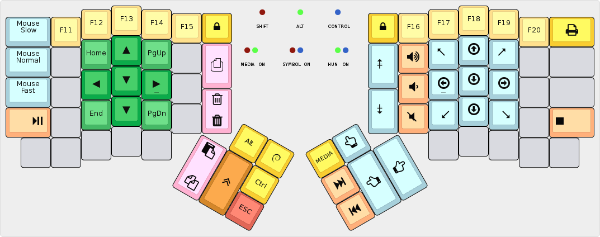

algernon's layout
=======================

This is an unconventional layout for the ErgoDox EZ: first of all, it is based
on the Dvorak layout, but moves a few keys elsewhere for an improved coding
experience. Second, there is no `DEL` key, nor a `Caps Lock`. Third, the
`SHIFT`, `Alt`, and `Control` keys are all sticky: when you press and release
them, they still register pressed, until you toggle them off.

But lets get on with the base layer, before I dive into a deeper explanation!

## Base layer

As you can see, this appears to be a somewhat unremarkable Dvorak layout, with
some very minor changes:

* The `Backslash/Pipe` key moved a row up, because it is easier to reach it on
  the 4th row than on the 5th.
* Consequently `Minus/Underscore` key was moved to the left half.
* There are dedicated `bracket` and `parens` keys.

Apart from these changes, as far as the alphanumerics are considered, this is
just plain old Dvorak. The fun comes with the modifiers, and their behaviour!

I had trouble holding the modifiers when they were out on the side, under the
reach of the pinky, because my weakest finger does not like holding stuff at
all. So I had to find a new place for these keys, and as such, they were moved
to the thumb cluster. But holding them with the thumb is even more awkward, you
may rightfully say. And that's the trick: they are not held, but toggled. Since
the thumb is the strongest finger, but also the least flexible (at least as far
as keyboard gymnastics are concerned), it can effortlessly hit keys in fast
succession, if so need be.

Similarly, the layer keys are toggles too. There is only one modifier, that is
not a toggle: the GUI key, simply because I ran out of leds, and because that is
the modifier I use the least.

The navigation keys are somewhat experimental at the moment, I'm not entirely
happy with how they turned out.

Oh! The Emacs keys in the lower corners! That sends an `M-m`, to use with
Spacemacs' `holy-mode`.

## Symbols layer

## Media layer

